<div align="center">

# NyayaSakhi AI — Voice Legal Guide

**Your voice. Your rights. Your inheritance.**

A gentle, voice-first legal guide for rural women in India — understand inheritance and property rights
in your own language, upload documents for plain-language explanations, and find real nearby help.

Live: **[nyayasakhi-ai.vercel.app](https://nyayasakhi-ai.vercel.app/)**

[](https://react.dev)
[](https://vitejs.dev)
[](https://www.typescriptlang.org)
[](https://supabase.com)
[](https://ai.google.dev)


</div>

<div align="center">
  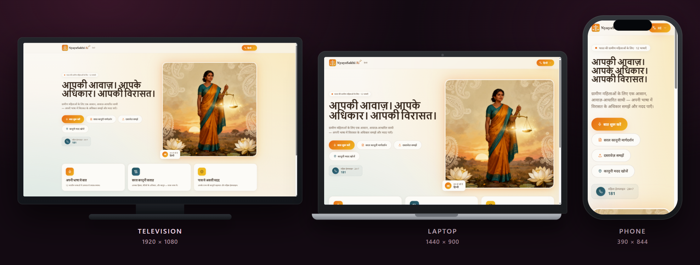
  <p><em>One app · three displays — television, laptop, and phone. Layout adapts to each screen.</em></p>
</div>

---

## Why this exists

Inheritance and property papers are written for lawyers — not for the women who need them most.
**NyayaSakhi AI** is a voice-first companion: speak in your language, get simple answers about your share
and daughters' rights, upload a notice or PDF to understand it, and dial real helplines nearby.

> Built with care for the women of India. This is general guidance — not a substitute for a lawyer.

---

## What you can do

- **Talk in 12 Indian languages** — Hindi, English, Kannada, Tamil, Telugu, Marathi, Bengali, Gujarati, Malayalam, Punjabi, Odia, Assamese — with voice in and voice out.
- **Voice chatbot** — ask anything about inheritance rights; NyayaSakhi listens, answers, and reads back.
- **Understand a document** — upload PDF / JPG / PNG (up to 10 MB); get a plain-language explanation.
- **Find legal help nearby** — free legal aid, NGOs, and women's helplines by state (including 181).
- **Simple legal guidance** — your share, daughters' rights, and the law — without jargon.
- **Works on every screen** — phone, laptop, and television layouts.

---

## See it on every display

| Laptop · 1440 × 900 | Phone · 390 × 844 |
| :---: | :---: |
| 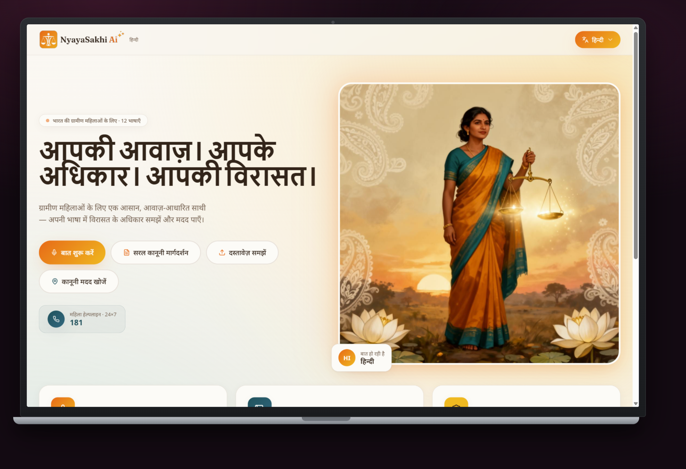 | 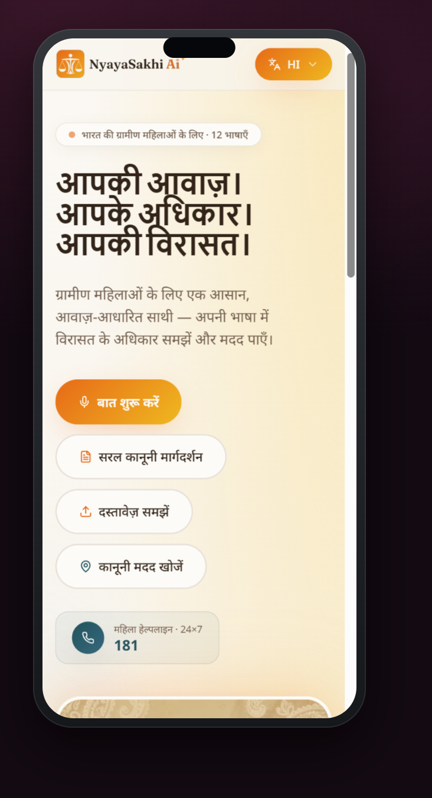 |

<div align="center">

### Television · 1920 × 1080

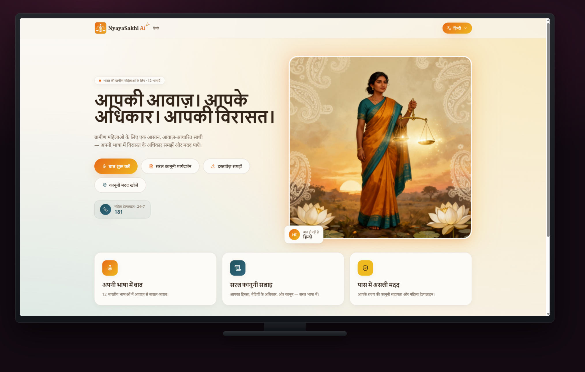

</div>

---

## Every feature, one by one

### 1 · Home — Hindi first

Default landing in हिन्दी, with clear CTAs for chat, documents, and legal help.

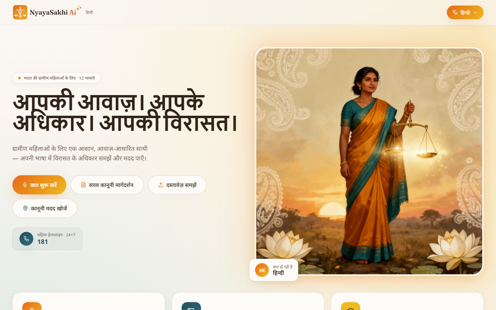

### 2 · Voice chatbot

Press to speak or type. Ask about inheritance rights in your language.

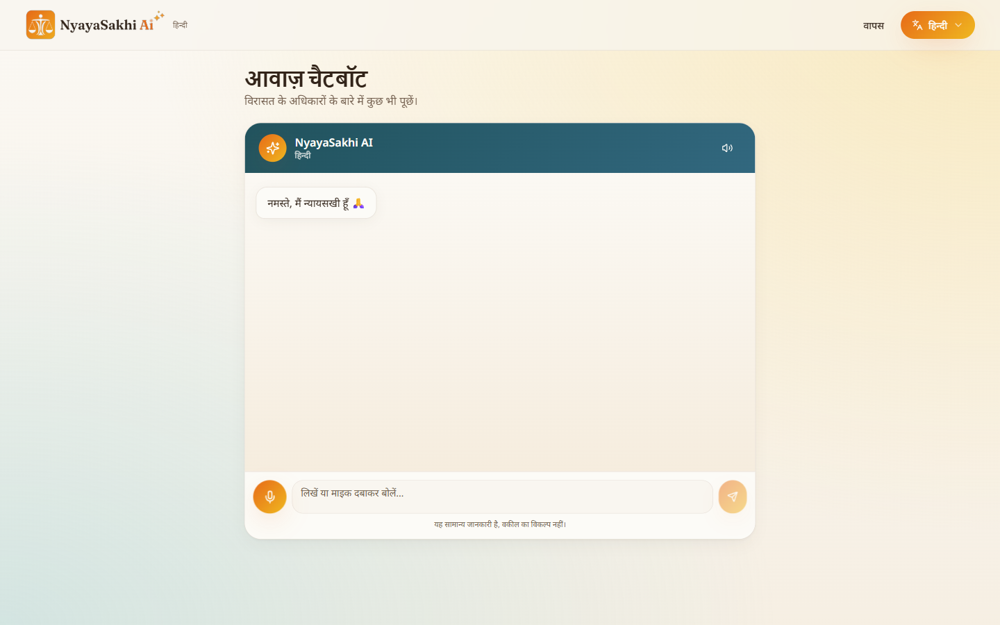

### 3 · Understand a document

Upload a letter, notice, or paper (PDF / photo). Get a simple explanation back.

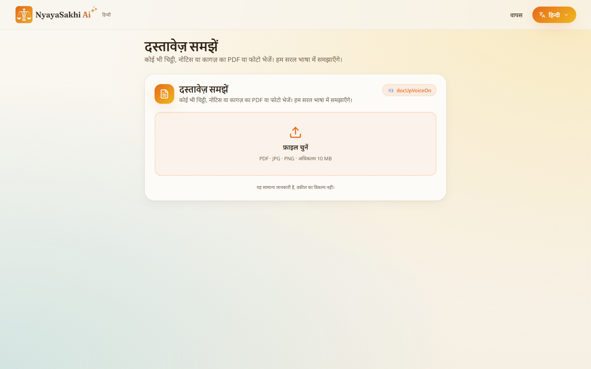

### 4 · Nearby legal help

State-wise directory of legal aid, NGOs, and helplines — with one-tap call links.

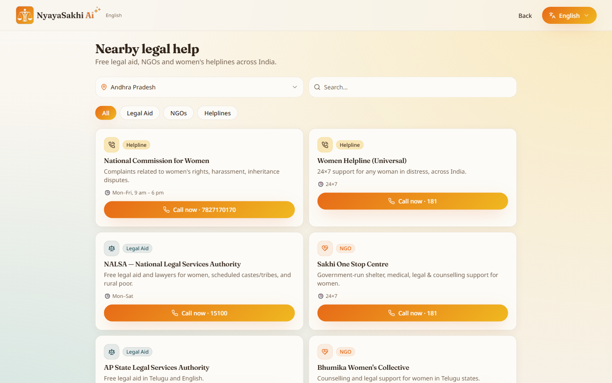

### 5 · 12 languages

| Language picker | English | ಕನ್ನಡ |
| :---: | :---: | :---: |
| 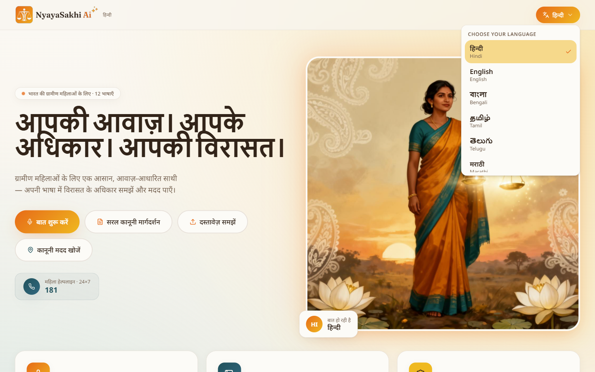 | 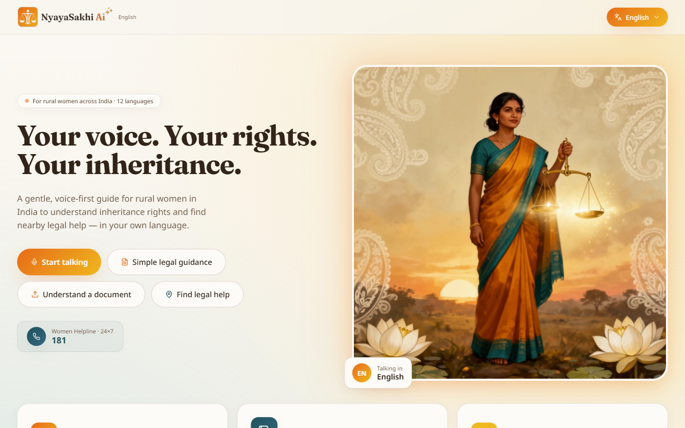 | 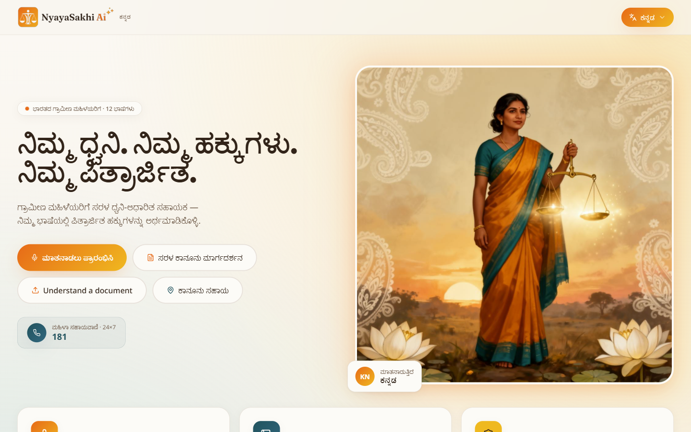 |

---

## Tech stack

| Layer | Technology |
| --- | --- |
| Frontend | React 18 · Vite 5 · TypeScript · Tailwind CSS · shadcn/ui |
| Backend | Supabase Edge Functions (Deno) · Vercel `/api/nyaya-chat` |
| AI | Gemini (via Lovable AI gateway) — streaming responses |
| Docs | PDF.js · Tesseract.js (OCR for photos) |
| Deploy | Vercel |

---

## Getting started (run it locally)

**Prerequisites:** [Node.js 18+](https://nodejs.org).

```bash
# 1. Clone
git clone https://github.com/Nishanth1409/nyayasakhi-ai.git
cd nyayasakhi-ai

# 2. Install
npm install

# 3. Configure env
cp .env.example .env
# Fill in:
#   VITE_SUPABASE_URL=
#   VITE_SUPABASE_PUBLISHABLE_KEY=
#   VITE_SUPABASE_PROJECT_ID=
# On Supabase / Vercel also set:
#   LOVABLE_API_KEY=   (AI gateway for chat + documents)

# 4. Start
npm run dev
```

Open **http://localhost:5173**.

### Handy scripts

| Command | What it does |
| --- | --- |
| `npm run dev` | Vite dev server |
| `npm run build` | Production build (checks Vercel env) |
| `npm run preview` | Preview the production build |
| `npm run test` | Run Vitest |

---

## Project structure

```
nyayasakhi-ai/
├─ src/
│  ├─ components/       # Chat, documents, help, UI
│  ├─ pages/            # Index + NotFound
│  ├─ hooks/ · lib/     # Shared logic
│  └─ integrations/     # Supabase client
├─ api/                 # Vercel serverless chat route
├─ supabase/functions/  # Edge function (nyaya-chat)
├─ public/
└─ docs/screenshots/    # README device + feature shots
```

---

## Live & credits

| | |
| :--- | :--- |
| **Live** | [nyayasakhi-ai.vercel.app](https://nyayasakhi-ai.vercel.app/) |
| **Author** | [Nishanth K R](https://github.com/Nishanth1409) |
| **Portfolio** | [nkrportfolio.vercel.app](https://nkrportfolio.vercel.app) |

---

<div align="center">

*Son of a farmer · always a farmer.*

[GitHub](https://github.com/Nishanth1409) · [Portfolio](https://nkrportfolio.vercel.app)

</div>

